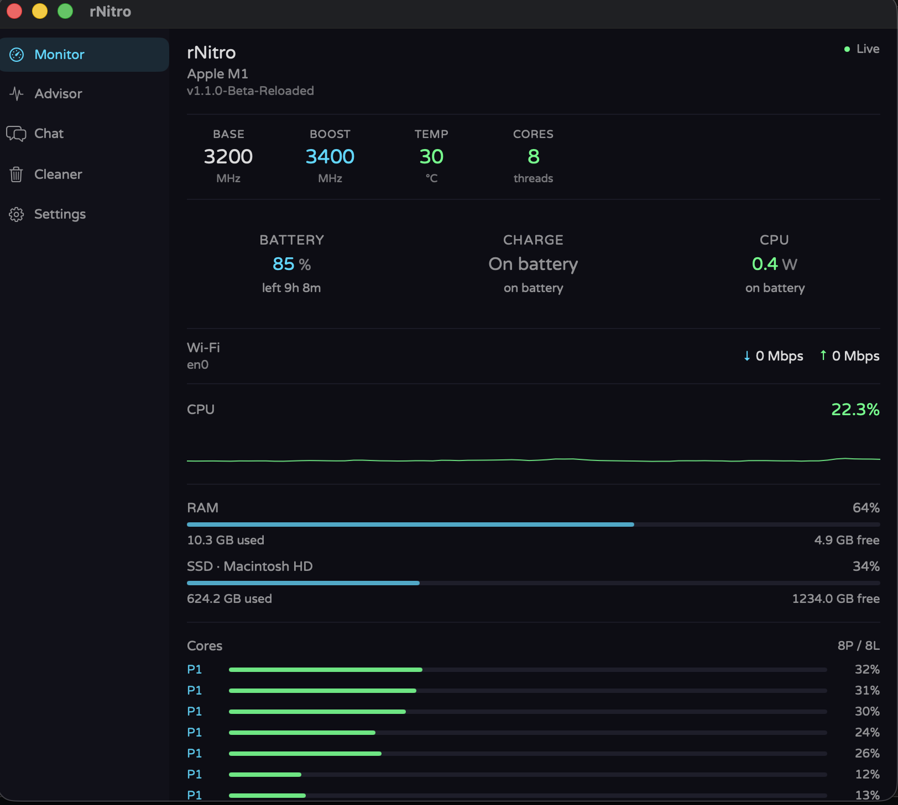
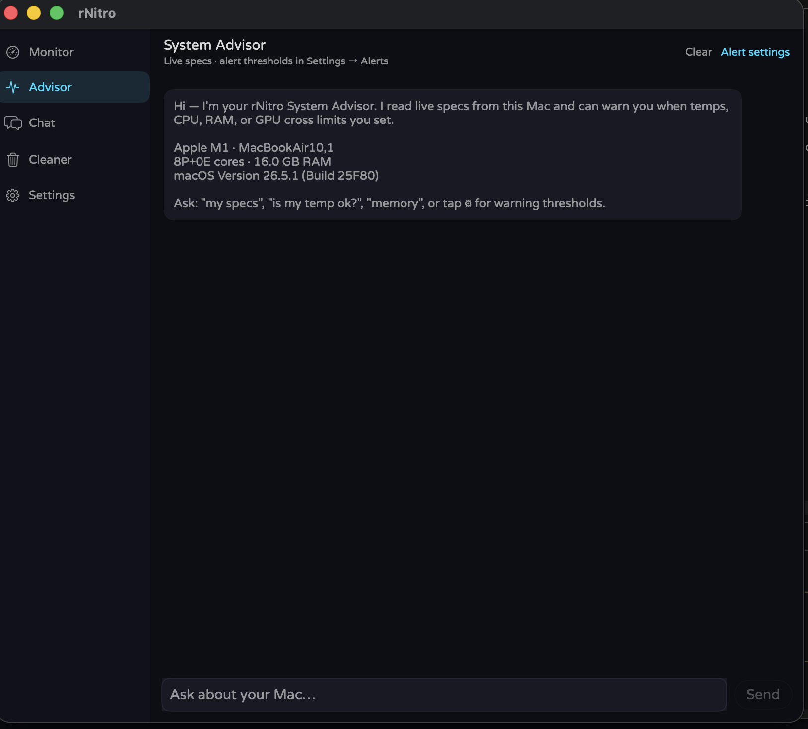
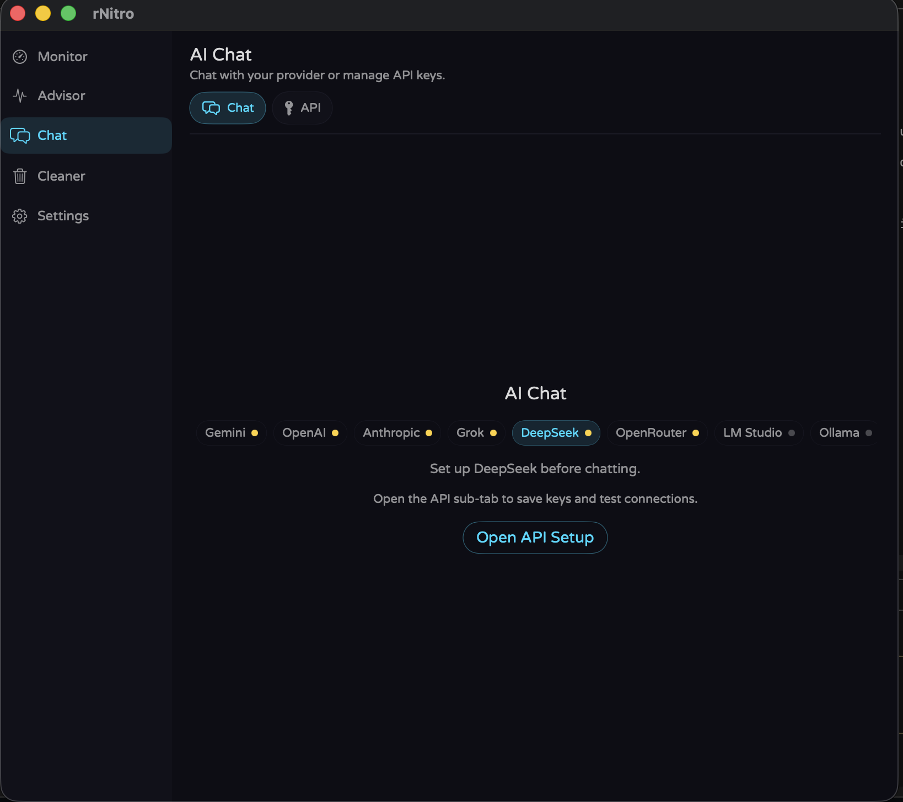
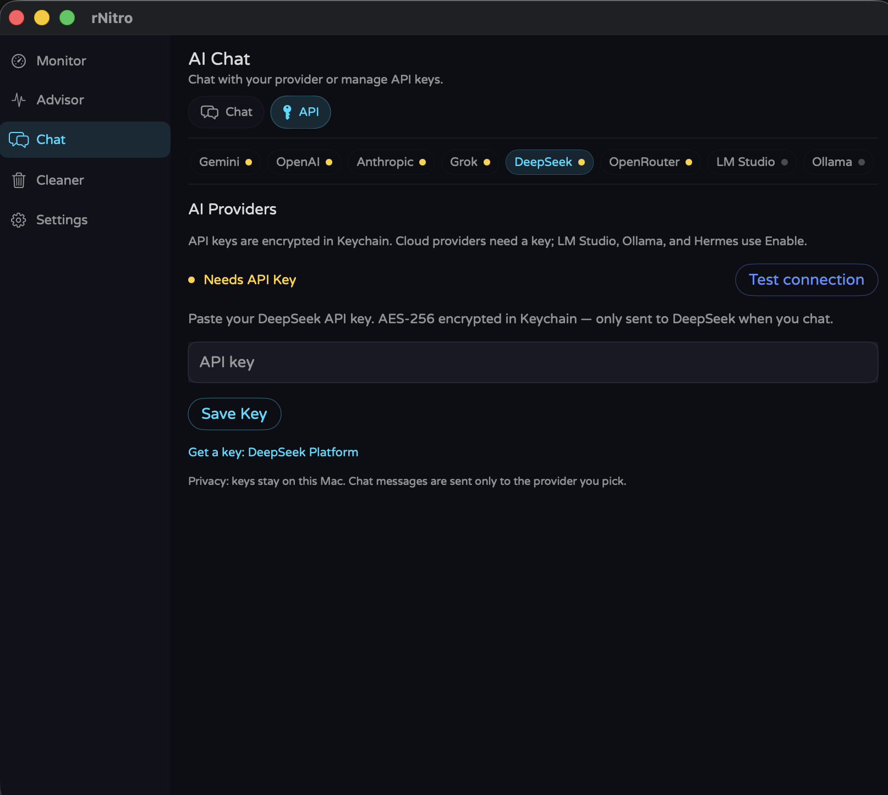
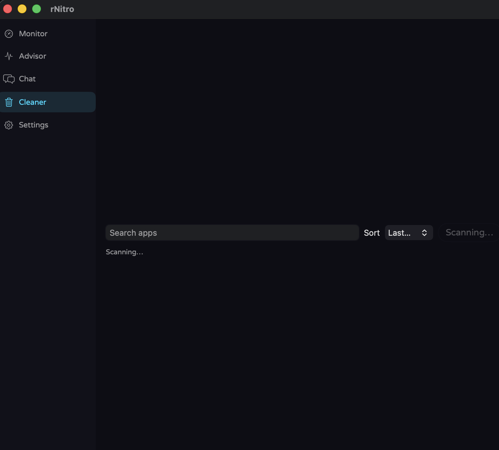
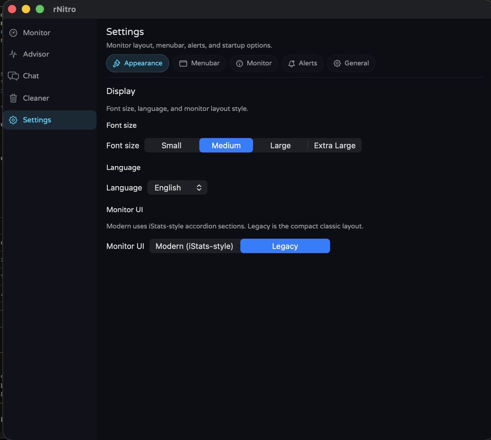

# rNitro

> Free menu bar system monitor for Apple Silicon Macs — CPU, temperature, battery, GPU, RAM, and network. Open source. No account. No telemetry.

**[Download](https://getrnitro.netlify.app/)** · **[chopstickshq.com/rnitro](https://chopstickshq.com/rnitro/)** · **[CLI](https://getrnitro.netlify.app/cli.html)** · **[Linux](https://getrnitro.netlify.app/linux.html)** · **[Windows](https://getrnitro.netlify.app/windows.html)** · **[Privacy](https://getrnitro.netlify.app/privacy.html)** · **[Releases](https://github.com/ilikemacos/rNitro/releases)**

> Same product site UI at **[getrnitro.netlify.app](https://getrnitro.netlify.app/)** and **[chopstickshq.com/rnitro](https://chopstickshq.com/rnitro/)** (HQ hub: [chopstickshq.com](https://chopstickshq.com/)).

[](https://github.com/ilikemacos/rNitro/releases/tag/v1.1.0-Final-Reloaded)
[](https://github.com/ilikemacos/rNitro/releases/tag/v1.2.4)
[](https://github.com/ilikemacos/rNitro/releases/tag/v1.2.4-Experimental)
[](LICENSE)

---

## Screenshots

<p align="center">
  
</p>

| Advisor | Chat | Chat Config |
|:---:|:---:|:---:|
|  |  |  |

| App cleaner | Settings |
|:---:|:---:|
|  |  |

---

## Channels

| Channel | Version | Best for |
|---------|---------|----------|
| **Stable** | v1.1.0 Final Reloaded | Daily CPU / temp / battery / GPU / RAM monitoring |
| **Beta** | v1.2.4 | Slim Lab + full AI provider list + Advisor + Cleaner |
| **Experimental** | v1.2.4 Experimental | Beta + toys (duel, cloak, SOC budget, widgets, …) — expect breakage |

**Recent:** ⌘Q now quits the menu bar app · Lab scrub-slider crash fixed · Experimental Features sidebar on Experimental builds.

---

## Quick install (macOS)

### App ZIP (recommended — no admin password)

1. Download **App ZIP** from [getrnitro.netlify.app](https://getrnitro.netlify.app/) or [Releases](https://github.com/ilikemacos/rNitro/releases)
2. Unzip → drag **rNitro.app** into **Applications**
3. First launch: right-click → **Open** → **Open** if Gatekeeper blocks it

### Terminal (compile on your Mac)

<!-- @sync:readme-curl -->
**Stable (v1.2.0 Final):**
```bash
curl -fsSL https://getrnitro.netlify.app/rNitro-v1.2.0-Final.sh -o /tmp/rnitro-install.sh && bash /tmp/rnitro-install.sh
```

**Beta (v1.2.7 Beta):**
```bash
curl -fsSL https://getrnitro.netlify.app/rNitro-v1.2.7.sh -o /tmp/rnitro-install.sh && bash /tmp/rnitro-install.sh
```
<!-- @end:readme-curl -->

### Homebrew

```bash
brew tap ilikemacos/rnitro
brew install rnitro
```

If Homebrew reports permission errors on `/opt/homebrew`, run `sudo chown -R "$(whoami)" /opt/homebrew/Cellar /opt/homebrew/Library` and try again. Or use the [install script](https://github.com/ilikemacos/homebrew-rnitro/blob/main/install.sh).

---

## Download (GitHub Releases)

Each macOS release includes **App ZIP** (`rNitro.app`), **PKG**, and **DMG**.

<!-- @sync:readme-downloads -->
### Stable — v1.2.0 Final

| Format | File |
|--------|------|
| **App ZIP** | [rNitro-v1.2.0-Final.zip](https://github.com/ilikemacos/rNitro/releases/download/v1.2.0-Final/rNitro-v1.2.0-Final.zip) |
| **PKG** | [rNitro-v1.2.0-Final.pkg](https://github.com/ilikemacos/rNitro/releases/download/v1.2.0-Final/rNitro-v1.2.0-Final.pkg) |
| **DMG** | [rNitro-v1.2.0-Final.dmg](https://github.com/ilikemacos/rNitro/releases/download/v1.2.0-Final/rNitro-v1.2.0-Final.dmg) |

### Beta — v1.2.7 Beta

| Format | File |
|--------|------|
| **App ZIP** | [rNitro-v1.2.7.zip](https://github.com/ilikemacos/rNitro/releases/download/v1.2.7/rNitro-v1.2.7.zip) |
| **PKG** | [rNitro-v1.2.7.pkg](https://github.com/ilikemacos/rNitro/releases/download/v1.2.7/rNitro-v1.2.7.pkg) |
| **DMG** | [rNitro-v1.2.7.dmg](https://github.com/ilikemacos/rNitro/releases/download/v1.2.7/rNitro-v1.2.7.dmg) |
<!-- @end:readme-downloads -->

[All releases →](https://github.com/ilikemacos/rNitro/releases)

---

## Features

### Monitor
- **CPU** — total usage, load average, per-core bars, base/boost MHz, package power (watts)
- **Temperature** — die temperature via SMC / IOHID sensors
- **Battery** — charge %, time remaining, charging state (MacBooks; direct IOKit)
- **GPU & RAM** — usage, memory pressure, swap
- **Network** — live upload/download on the active interface
- **Menubar** — configurable slots (CPU, temp, RAM, power, battery, and more)

### Tools
- **System Advisor** — threshold warnings for temp, CPU, RAM, GPU, battery (no API key)
- **App Cleaner** — find leftover app files
- **Stress test / benchmark** — load the machine on purpose
- **AI chat** (optional, bring your own keys)
  - Stable: OpenAI + OpenRouter
  - Beta / Experimental: Gemini, OpenAI, Anthropic, Grok, DeepSeek, OpenRouter, LM Studio, Ollama, Hermes

### Lab (Beta+)
Weather-style thermal glance, **Why hot?** detective, Whisper menubar glyph, compile-farm detection, time-scrub, power receipt.

### Experimental only
Stress duel, ghost-load, SOC budget, meeting cloak, polite peer, AirDrop card, desktop widget, confession, alibi, presets — for people who want the full playground.

---

## Platforms

| Platform | Status |
|----------|--------|
| **macOS** (Apple Silicon) | Primary — Stable / Beta / Experimental |
| **macOS** (Intel) | Source installers (Intel EOL banner after v1.2.5-Beta planning) |
| **Linux** | v0.1 pre-release (GTK4) |
| **Windows** | Deprecated last builds available |
| **CLI** | Terminal companion (`rNitro-CLI.tar.gz`) |

---

## Requirements (macOS app)

- macOS 12 Monterey or later  
- Apple Silicon (M1 / M2 / M3 / M4) for official App ZIP / PKG / DMG  
- Launch at Login needs macOS 13+  

---

## Open source

This repository holds the rNitro site, installers, and tooling:

| Path | What it is |
|------|------------|
| `install-rNitro.sh` | Main macOS app (SwiftUI) — compile-on-install installer |
| `install-rNitro-experimental.sh` | Experimental channel installer |
| `install-rNitro-intel.sh` | Intel macOS source installer |
| `install-rNitro-linux.sh` | Linux companion installer |
| `linux/` | Linux monitor source |
| `windows/` | Windows tray app (legacy) |
| `cli/` | Terminal CLI |
| `homebrew/` | Homebrew formula ([ilikemacos/homebrew-rnitro](https://github.com/ilikemacos/homebrew-rnitro)) |
| `build-*.py`, `sync-versions.py`, `deploy-netlify.py` | Build, release, and site deploy |
| `docs/launch/` | Product Hunt + AlternativeTo copy |
| `index.html` | Download website |

Pre-built `.zip`, `.pkg`, and `.dmg` files ship on [GitHub Releases](https://github.com/ilikemacos/rNitro/releases), not in git.

### Build from source (macOS)

```bash
git clone https://github.com/ilikemacos/rNitro.git
cd rNitro
bash install-rNitro.sh          # Beta
# bash install-rNitro-experimental.sh
```

Requires Xcode Command Line Tools (`xcode-select --install`). Installs `rNitro.app` to `~/Applications`.

### Build a release ZIP locally

```bash
python3 sync-versions.py
python3 build-app-zip.py --variant beta   # or stable / experimental / all
```

---

## Privacy

- No accounts  
- No telemetry  
- API keys you add stay on your Mac (Keychain / encrypted storage on beta paths)  

See [Privacy](https://getrnitro.netlify.app/privacy.html).

---

## Launch materials

Ready-to-paste posts:

- [Product Hunt](docs/launch/product-hunt.md)  
- [AlternativeTo](docs/launch/alternativeto.md)  

---

## Part of Chopsticks HQ

rNitro is the first product under [Chopsticks HQ](https://chopstickshq.com/) — independent tools, no nonsense.

| URL | What |
|-----|------|
| https://chopstickshq.com/ | Project hub |
| https://chopstickshq.com/rnitro/ | Full rNitro product site (same UI as getrnitro) |
| https://getrnitro.netlify.app/ | Canonical product / download CDN |

---

## License

[MIT](LICENSE)
